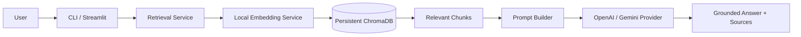

# MiniRAG Assistant

MiniRAG Assistant is a compact, portfolio-oriented Retrieval-Augmented
Generation (RAG) application. RAG means finding relevant passages in your own
documents before asking a language model to answer. This gives the model focused
context and lets the application show where its answer came from.

## V1 features

- Recursive PDF, UTF-8 TXT, and Markdown discovery and loading
- Page-aware, overlapping text chunks
- Local `sentence-transformers/all-MiniLM-L6-v2` embeddings
- Persistent local ChromaDB vector storage
- SHA-256 duplicate prevention and stable chunk IDs
- Semantic search with configurable cosine-distance filtering
- Grounded answers through OpenAI or Google Gemini
- Stable `[Source N]` citations with file, page, chunk, and distance metadata
- CLI commands for ingestion, indexing, search, and grounded questions
- Streamlit uploads, indexing status, questions, answers, and expandable sources
- Deterministic, network-free tests using injected fakes

No fine-tuning is performed. Embeddings and ChromaDB run locally. During answer
generation, only the retrieved text chunks—not complete documents—are sent to
the configured external LLM API.

## Architecture



Indexing follows a separate path:

```text
Document → Loader → Page-aware Chunker → SHA-256 Check → Local Embeddings → ChromaDB
```

The application keeps document loading, chunking, hashing, embedding, vector
storage, retrieval, prompt construction, provider SDKs, uploads, and UI code in
separate focused modules. Neither LangChain nor LlamaIndex is used.

## Technology stack

- Python 3.11+
- pypdf
- Sentence Transformers
- ChromaDB
- OpenAI Python SDK using the Responses API
- Google Gen AI Python SDK
- Streamlit
- pytest

## Setup

```bash
python3.11 -m venv .venv
source .venv/bin/activate
python -m pip install -r requirements.txt
cp .env.example .env
```

The embedding model downloads on first indexing or search and then runs locally.
No LLM key is needed for `ingest`, `index`, or `search`.

### OpenAI configuration

```env
LLM_PROVIDER=openai
LLM_MODEL=gpt-4.1-mini
OPENAI_API_KEY=your_openai_key
GEMINI_API_KEY=
```

### Gemini configuration

```env
LLM_PROVIDER=gemini
LLM_MODEL=gemini-2.5-flash
OPENAI_API_KEY=
GEMINI_API_KEY=your_gemini_key
```

Never commit `.env`. It is ignored by Git, and provider keys are not displayed
by the CLI or Streamlit interface.

## Configuration reference

| Variable | Default | Purpose |
| --- | --- | --- |
| `DATA_DIR` | `data` | Default local document directory |
| `UPLOAD_DIR` | `data/uploads` | Managed Streamlit upload directory |
| `MAX_UPLOAD_SIZE_MB` | `10` | Per-file application upload limit |
| `CHUNK_SIZE` | `800` | Maximum characters per chunk |
| `CHUNK_OVERLAP` | `150` | Characters retained between chunks |
| `EMBEDDING_MODEL` | `sentence-transformers/all-MiniLM-L6-v2` | Local embedding model |
| `CHROMA_PERSIST_DIR` | `.chroma` | Persistent vector data directory |
| `CHROMA_COLLECTION_NAME` | `minirag_documents` | Chroma collection name |
| `DEFAULT_TOP_K` | `4` | Maximum retrieved context chunks |
| `MAX_RETRIEVAL_DISTANCE` | `1.2` | Largest accepted cosine distance |
| `LLM_PROVIDER` | `openai` | `openai` or `gemini` |
| `LLM_MODEL` | `gpt-4.1-mini` | Selected provider model |
| `OPENAI_API_KEY` | empty | OpenAI credential used only for answers |
| `GEMINI_API_KEY` | empty | Gemini credential used only for answers |
| `ANSWER_TEMPERATURE` | `0.2` | LLM generation temperature, from 0 to 2 |
| `MAX_ANSWER_TOKENS` | `500` | Maximum answer tokens |
| `LLM_REQUEST_TIMEOUT` | `30` | Provider timeout in seconds |
| `MAX_CONTEXT_CHARACTERS` | `12000` | Prompt-context safety limit |

Chroma uses cosine distance: lower is more relevant, and `0` means identical
vector direction. Results above `MAX_RETRIEVAL_DISTANCE` are excluded before
answer generation. The default `1.2` is a starting point that should be tuned
against representative documents and questions.

## CLI usage

Inspect chunks without storing them:

```bash
python -m app.main ingest ./data
```

Index a directory or one document:

```bash
python -m app.main index ./data
python -m app.main index ./data/project-plan.pdf
```

Search without calling an LLM:

```bash
python -m app.main search "What is the project deadline?"
python -m app.main search "What is the project deadline?" --top-k 2
```

Ask a grounded question:

```bash
python -m app.main ask "What is the project deadline?"
python -m app.main ask "What is the project deadline?" --top-k 4
```

Example answer:

```text
The project deadline is Friday at 5 PM [Source 1].

Sources:
- [Source 1] data/project-plan.pdf, page 4, chunk 7, distance 0.2841
```

If no chunk passes the configured threshold, MiniRAG returns a deterministic
no-information message and does not build a provider or call an LLM.

## Streamlit interface

```bash
streamlit run app/ui.py
```

Use the sidebar to upload one or more PDF, TXT, or Markdown files and select
**Index documents**. Uploaded files are sanitized, content-addressed, and saved
under `UPLOAD_DIR`; repeated content is skipped through the same SHA-256 logic as
the CLI. The main area accepts questions and displays the answer plus expandable
source citations.

The interface shows the selected models but never API keys. It also states that
retrieved chunks are sent to the selected external provider for answer
generation.

## Example workflow

```bash
cp project-plan.pdf data/
python -m app.main index data
python -m app.main search "delivery date"
python -m app.main ask "When is the delivery date?"
streamlit run app/ui.py
```

## Tests

```bash
pytest -q
```

Tests use temporary directories, deterministic embeddings, fake providers, and
fake vector stores. They do not require API keys, contact OpenAI or Gemini, or
download an embedding model. Coverage includes existing ingestion/indexing,
provider selection, grounded prompts, citations, no-context behavior, CLI
dispatch, safe uploads, duplicate uploads, and persistent vector storage.

## Local data, privacy, and cost

- Source documents, upload content, model caches, `.env`, and `.chroma` data are
  excluded from Git.
- Document parsing, embeddings, hashing, and vector search happen locally.
- Only retrieved chunks and the user's question are sent to OpenAI or Gemini
  when `ask` is used.
- External providers may retain or process requests according to their own
  policies; review those policies before using sensitive documents.
- Provider calls may incur API charges. Indexing and semantic search do not call
  an LLM API.

To clear the local index, stop MiniRAG, verify `CHROMA_PERSIST_DIR`, and remove
that generated directory. With the default configuration:

```bash
rm -rf .chroma
```

This does not remove source documents. Uploaded documents can be cleared
separately from the configured `UPLOAD_DIR` after verifying the path.

## Known limitations

- Retrieval relevance depends on document quality and threshold tuning.
- Changed document content creates a new hash; stale versions are not removed
  automatically.
- Citations identify supporting chunks but are not independently fact-checked.
- V1 has no authentication, conversation memory, hybrid keyword search, or
  streaming answer output.

## Roadmap

- Multi-RAG routing across specialized document collections
- Agentic tool selection
- Conversation memory
