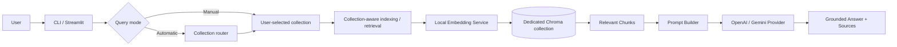

# MiniRAG Assistant

MiniRAG Assistant is a compact, portfolio-oriented Retrieval-Augmented
Generation (RAG) application. RAG means finding relevant passages in your own
documents before asking a language model to answer. This gives the model focused
context and lets the application show where its answer came from.

## V1 features

- Recursive PDF, UTF-8 TXT, and Markdown discovery and loading
- Page-aware, overlapping text chunks
- Local `sentence-transformers/all-MiniLM-L6-v2` embeddings
- Persistent local ChromaDB vector storage
- SHA-256 duplicate prevention and stable chunk IDs
- Semantic search with configurable cosine-distance filtering
- Grounded answers through OpenAI or Google Gemini
- Stable `[Source N]` citations with file, page, chunk, and distance metadata
- CLI commands for ingestion, indexing, search, and grounded questions
- Streamlit uploads, indexing status, questions, answers, and expandable sources
- User-selected logical RAG collections backed by isolated Chroma collections
- Manual or automatic single-collection query routing with explainable decisions
- Optional bounded agent that executes one or two predefined tools
- Deterministic, network-free tests using injected fakes

No fine-tuning is performed. Embeddings and ChromaDB run locally. During answer
generation, only the retrieved text chunks—not complete documents—are sent to
the configured external LLM API.

## Architecture



Indexing follows a separate path:

```text
Document → Loader → Page-aware Chunker → SHA-256 Check → Local Embeddings → ChromaDB
```

A logical RAG collection is a user-facing namespace such as `general`,
`project`, or `technical`. Each logical collection resolves to a separate
physical Chroma collection, for example
`minirag_documents__technical`. Documents and duplicate checks are therefore
isolated: the same file can be indexed once in `project` and once in
`technical`, while repeated indexing inside either collection is still skipped.
The logical `general` collection retains the original unsuffixed
`CHROMA_COLLECTION_NAME`, so existing V1 indexes remain available.

Question routing always resolves to exactly one logical collection before
retrieval. Manual mode remains the default and preserves the original behavior.
Automatic mode uses deterministic keyword scoring by default: exact keywords
score one point, multi-word phrases score two, configured collection order
breaks ties, and no match selects `DEFAULT_RAG_COLLECTION`. Built-in routing
descriptions cover `general`, `project`, `technical`, and `policies`. Other safe
collection names continue to work manually but are not automatically selected
without a defined routing description.

Optional LLM routing requests strict JSON containing one allowed collection,
a reason, and confidence. The question is marked as untrusted prompt data and
the result is validated against configured collection names. Provider errors,
malformed output, and unknown names visibly fall back to deterministic routing.
Neither strategy searches multiple collections or combines their results.

## Bounded Multi-Step Agent

The optional agent adds a deliberately bounded decision layer before the
existing services:

```text
User request
    ↓
Deterministic intent classifier and plan selector
    ↓
One-step or two-step predefined plan
    ↓
Sequential tool execution
    ↓
Structured response
```

Keyword rules classify requests as collection listing, routing inspection, or
semantic search. Everything else defaults to grounded question answering. The
selector returns the chosen tool and a human-readable reason without executing
it. Clear compound phrases can select one of two fixed two-step plans. All
supported plans are:

- `ask`: `AskTool`
- `search`: `SearchTool`
- `collections`: `CollectionsTool`
- `routing`: `RoutingTool`
- `route_and_ask`: `RoutingTool → AskTool`
- `route_and_search`: `RoutingTool → SearchTool`

The tools remain small adapters over existing services:

- `AskTool` uses automatically routed grounded answering.
- `SearchTool` uses automatically routed semantic retrieval without an LLM answer.
- `CollectionsTool` lists the existing logical collection registry.
- `RoutingTool` reuses the existing router without retrieval.

Plans are selected from this fixed catalog; they are never invented by an LLM.
Compound execution passes the first routing decision through an ephemeral
per-request context, so Ask/Search uses the same collection without routing a
second time. The context is discarded after the request and is not memory.

This is bounded tool selection, not autonomous planning. Plans contain at most
two tools and stop immediately on failure. There are no retries, recursive
calls, reflection, conversation memory, or background work. The layer uses no
agent framework: LangChain, LangGraph, CrewAI, AutoGen, and similar frameworks
are intentionally absent.

### Agent planning strategies

The planning layer now has a common interface with two implementations:

- `DeterministicAgentPlanner` wraps the existing intent, tool, and fixed-plan
  selection rules without changing their behavior.
- `LLMAgentPlanner` uses the configured OpenAI or Gemini text provider to
  produce JSON, then validates it as a bounded `AgentDecision` with one or two
  registered tool steps.

`AGENT_PLANNING_MODE` defaults to `deterministic`. In Sprint 1, `llm` mode is an
isolated planning capability only: it can generate and validate a structured
decision, but the CLI, Streamlit UI, and agent executor do not invoke or execute
LLM-generated plans yet. There is no fallback, retry, retrieval, or answer
generation inside the planner.

The application keeps document loading, chunking, hashing, embedding, vector
storage, retrieval, prompt construction, provider SDKs, uploads, and UI code in
separate focused modules. Neither LangChain nor LlamaIndex is used.

## Technology stack

- Python 3.11+
- pypdf
- Sentence Transformers
- ChromaDB
- OpenAI Python SDK using the Responses API
- Google Gen AI Python SDK
- Pydantic
- Streamlit
- pytest

## Setup

```bash
python3.11 -m venv .venv
source .venv/bin/activate
python -m pip install -r requirements.txt
cp .env.example .env
```

The embedding model downloads on first indexing or search and then runs locally.
No LLM key is needed for `ingest`, `index`, or `search`.

### OpenAI configuration

```env
LLM_PROVIDER=openai
LLM_MODEL=gpt-4.1-mini
OPENAI_API_KEY=your_openai_key
GEMINI_API_KEY=
```

### Gemini configuration

```env
LLM_PROVIDER=gemini
LLM_MODEL=gemini-2.5-flash
OPENAI_API_KEY=
GEMINI_API_KEY=your_gemini_key
```

Never commit `.env`. It is ignored by Git, and provider keys are not displayed
by the CLI or Streamlit interface.

## Configuration reference

| Variable | Default | Purpose |
| --- | --- | --- |
| `DATA_DIR` | `data` | Default local document directory |
| `UPLOAD_DIR` | `data/uploads` | Managed Streamlit upload directory |
| `MAX_UPLOAD_SIZE_MB` | `10` | Per-file application upload limit |
| `CHUNK_SIZE` | `800` | Maximum characters per chunk |
| `CHUNK_OVERLAP` | `150` | Characters retained between chunks |
| `EMBEDDING_MODEL` | `sentence-transformers/all-MiniLM-L6-v2` | Local embedding model |
| `CHROMA_PERSIST_DIR` | `.chroma` | Persistent vector data directory |
| `CHROMA_COLLECTION_NAME` | `minirag_documents` | Chroma collection name |
| `DEFAULT_RAG_COLLECTION` | `general` | Collection used when none is supplied |
| `RAG_COLLECTIONS` | `general,project,technical,policies` | Streamlit/listed choices |
| `DEFAULT_QUERY_MODE` | `manual` | Default question mode: `manual` or `automatic` |
| `RAG_ROUTING_MODE` | `deterministic` | Automatic strategy: `deterministic` or `llm` |
| `AGENT_PLANNING_MODE` | `deterministic` | Structured planning strategy: `deterministic` or `llm` |
| `AGENT_PLANNING_TEMPERATURE` | `0.0` | LLM planner generation temperature, from 0 to 2 |
| `AGENT_MAX_PLANNING_TOKENS` | `400` | Maximum tokens for one structured planner response |
| `DEFAULT_TOP_K` | `4` | Maximum retrieved context chunks |
| `MAX_RETRIEVAL_DISTANCE` | `1.2` | Largest accepted cosine distance |
| `LLM_PROVIDER` | `openai` | `openai` or `gemini` |
| `LLM_MODEL` | `gpt-4.1-mini` | Selected provider model |
| `OPENAI_API_KEY` | empty | OpenAI credential used only for answers |
| `GEMINI_API_KEY` | empty | Gemini credential used only for answers |
| `ANSWER_TEMPERATURE` | `0.2` | LLM generation temperature, from 0 to 2 |
| `MAX_ANSWER_TOKENS` | `500` | Maximum answer tokens |
| `LLM_REQUEST_TIMEOUT` | `30` | Provider timeout in seconds |
| `MAX_CONTEXT_CHARACTERS` | `12000` | Prompt-context safety limit |

Chroma uses cosine distance: lower is more relevant, and `0` means identical
vector direction. Results above `MAX_RETRIEVAL_DISTANCE` are excluded before
answer generation. The default `1.2` is a starting point that should be tuned
against representative documents and questions.

## CLI usage

Inspect chunks without storing them:

```bash
python -m app.main ingest ./data
```

Index a directory or one document:

```bash
python -m app.main index ./data
python -m app.main index ./data/project-plan.pdf
python -m app.main index ./data --collection technical
```

Search without calling an LLM:

```bash
python -m app.main search "What is the project deadline?"
python -m app.main search "What is the project deadline?" --top-k 2
python -m app.main search "How is authentication implemented?" --collection technical
python -m app.main search "How is authentication implemented?" --auto-route
```

Ask a grounded question:

```bash
python -m app.main ask "What is the project deadline?"
python -m app.main ask "What is the project deadline?" --top-k 4
python -m app.main ask "What is the project deadline?" --collection project
python -m app.main ask "What is the project deadline?" --auto-route
```

Inspect an automatic routing decision without searching or answering:

```bash
python -m app.main route "How is authentication implemented?"
```

List the configured UI choices:

```bash
python -m app.main collections
```

Let the deterministic agent choose a bounded plan:

```bash
python -m app.main agent "How is authentication implemented?"
python -m app.main agent "Find authentication chunks"
python -m app.main agent "List collections"
python -m app.main agent "Which collection handles privacy?"
python -m app.main agent \
  "Explain the routing, then answer: how is authentication implemented?"
python -m app.main agent \
  "Route this question and show matching sources: where are refresh tokens stored?"
```

Single-step commands retain the selected-tool output. Compound commands print
the plan, reason, and both ordered step results.

Omitting both query flags uses `DEFAULT_QUERY_MODE`, which defaults to manual
selection of `DEFAULT_RAG_COLLECTION`. `--collection` and `--auto-route` are
mutually exclusive. Other safe logical names are accepted manually from the CLI
even when they are not listed in `RAG_COLLECTIONS`; configured choices primarily
make the UI and listing command deterministic.

Automatic commands print their selected collection, strategy, reason, and
confidence before results. For example:

```text
Selected collection: technical
Routing strategy: deterministic
Reason: Matched technical terms: authentication, implementation
Confidence: 0.50
```

Example answer:

```text
The project deadline is Friday at 5 PM [Source 1].

Sources:
- [Source 1] data/project-plan.pdf, page 4, chunk 7, distance 0.2841
```

If no chunk passes the configured threshold, MiniRAG returns a deterministic
no-information message and does not build a provider or call an LLM.

## Streamlit interface

```bash
streamlit run app/ui.py
```

Use the sidebar to upload one or more PDF, TXT, or Markdown files and select
the indexing collection before choosing **Index documents**. Uploads are always
indexed into this explicit selection. Questions can independently use manual
collection selection or automatic routing; automatic mode displays the chosen
collection and explanation. Selecting **Use Agent** lets the deterministic
agent choose how to handle questions. It does not affect uploads or indexing.
One-step results retain the existing display. Two-step results show the selected
plan, routing step, and final answer or retrieved chunks in order.
Uploaded files are sanitized, content-addressed, and saved
under `UPLOAD_DIR`; repeated content is skipped through the same SHA-256 logic as
the CLI. The main area accepts questions and displays the answer plus expandable
source citations.

The interface shows the selected models but never API keys. It also states that
retrieved chunks are sent to the selected external provider for answer
generation.

## Example workflow

```bash
cp project-plan.pdf data/
python -m app.main index data
python -m app.main search "delivery date" --collection general
python -m app.main ask "When is the delivery date?" --collection general
streamlit run app/ui.py
```

## Tests

```bash
pytest -q
pytest -q tests/test_agent_planner.py
```

Tests use temporary directories, deterministic embeddings, fake providers, and
fake vector stores. They do not require API keys, contact OpenAI or Gemini, or
download an embedding model. Coverage includes existing ingestion/indexing,
provider selection, deterministic and LLM-routing validation/fallback,
single-collection runtime orchestration, bounded plan validation and execution,
routing-context reuse, agent intent and tool selection, grounded prompts,
structured deterministic/LLM planner validation, citations, failure
short-circuiting, CLI dispatch, Streamlit orchestration, safe uploads, duplicate
uploads, and persistent vector storage.

## Local data, privacy, and cost

- Source documents, upload content, model caches, `.env`, and `.chroma` data are
  excluded from Git.
- Document parsing, embeddings, hashing, and vector search happen locally.
- Only retrieved chunks and the user's question are sent to OpenAI or Gemini
  when `ask` is used.
- External providers may retain or process requests according to their own
  policies; review those policies before using sensitive documents.
- Provider calls may incur API charges. Indexing and semantic search do not call
  an LLM API.

To clear the local index, stop MiniRAG, verify `CHROMA_PERSIST_DIR`, and remove
that generated directory. With the default configuration:

```bash
rm -rf .chroma
```

This does not remove source documents. Uploaded documents can be cleared
separately from the configured `UPLOAD_DIR` after verifying the path.

## Known limitations

- Retrieval relevance depends on document quality and threshold tuning.
- Changed document content creates a new hash; stale versions are not removed
  automatically.
- Citations identify supporting chunks but are not independently fact-checked.
- V1 has no authentication, conversation memory, hybrid keyword search, or
  streaming answer output.
- Automatic routing uses a small built-in route catalog; custom collections
  currently require manual selection.
- Routing picks one collection and does not perform cross-collection ranking.
- The agent recognizes only six fixed plans and cannot invent plans or use memory.
- LLM-generated agent decisions are validated but are not connected to tool
  execution in Sprint 1.

## Roadmap

- Configurable routing descriptions for custom collections
- Evaluated learned routing and cross-collection retrieval strategies
- Controlled integration of validated LLM decisions with bounded execution
- Additional explicit agent tools where they add clear user value
- Optional conversation features only if explicitly designed in a future milestone
