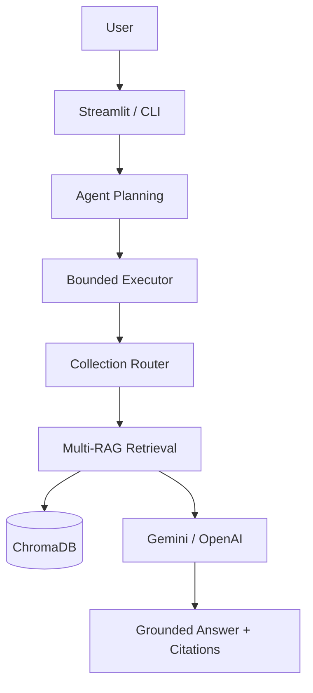

# MiniRAG Assistant

MiniRAG Assistant is a portfolio-oriented AI engineering project that demonstrates
modern Retrieval-Augmented Generation (RAG), Multi-RAG retrieval, and bounded
Agentic AI.

Rather than training a language model, the application combines local document
processing, semantic vector search, deterministic or LLM-based planning, and
grounded answer generation using external foundation models such as OpenAI GPT
or Google Gemini.

The project demonstrates how production AI systems are commonly built today:
documents are processed within the application runtime. Only retrieved evidence chunks and the user’s question are sent to the configured external LLM provider.

## 🚀 Live Demo

Try the deployed application on Streamlit Community Cloud:

https://minirag-assistant-79ryu9csxxnt8hclogc9gg.streamlit.app/

## Deploy to Streamlit Community Cloud

- Repository: berkin9/MiniRAG-Assistant
- Branch: main
- Main file: streamlit_app.py
- Python: 3.11

## Try the Demo

Index the provided sample documents into their corresponding collections:

| Document | Collection |
|----------|------------|
| Sample | `general` |
| Project | `project` |
| Technical | `technical` |
| Policies | `policies` |

Enable:

- ✅ Cross collection retrieval
- ✅ Automatic routing
- ✅ Use Agent

Then ask:

> Compare the authentication implementation with the security policy requirements.

Expected behaviour:

- Agent selects the **technical** and **policies** collections.
- Multi-RAG retrieves evidence from both collections.
- The answer is grounded and includes source citations.

Ask:

> Compare the authentication implementation with the security policy requirements.

## Quality

- ✅ Full automated test suite passing
- ✅ No external API calls during automated tests
- ✅ Deterministic fake providers and embeddings for reproducible testing
- ✅ Cross-collection retrieval, routing, citations, and agent planning covered by regression tests
  
## AI capabilities

- Retrieval-Augmented Generation (RAG)
- Multi-RAG with bounded cross-collection retrieval
- Local embedding generation
- Semantic vector search with ChromaDB
- Stable citation attribution
- Automatic collection routing
- Deterministic and LLM-based agent planning
- Bounded multi-step tool execution
- Grounded answer generation
- Deterministic fallback for routing and planning
- Planning benchmark and evaluation

## Foundation models

MiniRAG does **not** train or fine-tune language models.

Instead, it demonstrates a modern AI engineering workflow built around existing
foundation models.

MiniRAG focuses on AI application engineering rather than model training.

The application combines:

- local embeddings
- vector retrieval
- prompt engineering
- grounded generation
- bounded agent planning
- external LLM APIs

Only the retrieved evidence chunks and the user's question are sent to the
configured provider (OpenAI or Google Gemini). Complete documents are never
transmitted.

This architecture reflects how many production AI systems are built today.

## Architecture



Indexing follows a separate path:

```text
Document → Loader → Page-aware Chunker → SHA-256 Check → Local Embeddings → ChromaDB
```

A logical RAG collection is a user-facing namespace such as `general`,
`project`, or `technical`. Each logical collection resolves to a separate
physical Chroma collection, for example
`minirag_documents__technical`. Documents and duplicate checks are therefore
isolated: the same file can be indexed once in `project` and once in
`technical`, while repeated indexing inside either collection is still skipped.
The logical `general` collection retains the original unsuffixed
`CHROMA_COLLECTION_NAME`, so existing V1 indexes remain available.

Question routing always resolves to exactly one logical collection before
retrieval. Manual mode remains the default and preserves the original behavior.
Automatic mode uses deterministic keyword scoring by default: exact keywords
score one point, multi-word phrases score two, configured collection order
breaks ties, and no match selects `DEFAULT_RAG_COLLECTION`. Built-in routing
descriptions cover `general`, `project`, `technical`, and `policies`. Other safe
collection names continue to work manually but are not automatically selected
without a defined routing description.

Optional LLM routing requests strict JSON containing one allowed collection,
a reason, and confidence. The question is marked as untrusted prompt data and
the result is validated against configured collection names. Provider errors,
malformed output, and unknown names visibly fall back to deterministic routing.
Single-collection routing remains the default. Cross-collection Multi-RAG is a
separate configured retrieval strategy; it can select and search several
registered collections for one request.

## Cross-collection Multi-RAG

Set `RAG_RETRIEVAL_STRATEGY=cross_collection` to opt into Sprint 5. Existing
users retain `single_collection` by default, including the original retrieval
ordering, manual selection, routing, citations, and `DEFAULT_TOP_K` behavior.

```text
Query
  ↓
Bounded collection selector
  ↓
Collection A retrieval ─┐
Collection B retrieval ─┼─→ normalization → deduplication → RRF fusion
Collection C retrieval ─┘
  ↓
Global top evidence
  ↓
Grounded answer
```

Manual mode accepts up to `MULTIRAG_MAX_COLLECTIONS` registered names.
Automatic mode reuses the centralized route terms and selects every matching
route in deterministic score order, capped by the same limit. Optional LLM
selection makes one strict-JSON provider call, validates every name and bound,
and falls back once to deterministic selection after provider errors, malformed
output, unknown names, excessive selections, or low confidence. The LLM cannot
provide vector filters, retrieval limits, embeddings, or arbitrary tool inputs.

Each selected logical collection resolves through the existing registry to its
own physical Chroma collection and is searched exactly once. Chroma returns
cosine distance, where lower is better. Cross-collection results convert it to
the monotonic relevance score `1 / (1 + distance)`, where higher is better.
Distances must be finite and non-negative.

Exact duplicates are detected by stable chunk ID, normalized document/page/
chunk location, or a SHA-256 hash of whitespace-normalized text. The strongest
candidate is retained and all matching collection names remain on its source.
Deduplication can be disabled. Reciprocal Rank Fusion uses `1 / (60 + rank)`;
duplicate contributions are summed, followed by normalized relevance and
stable file/page/chunk/ID tie-breakers. Only `MULTIRAG_GLOBAL_TOP_K` evidence
chunks reach the grounded answer prompt.

An empty collection is not an error. An expected retrieval failure is recorded
by safe error type while other collections continue; the request fails only if
every selected collection fails. There are no retries. Fused citations include
their collection, and duplicate sources list every matched collection.

The separate human-editable dataset
`benchmarks/multirag_retrieval.json` measures collection exact match, precision,
recall, relevant-document recall at global K, duplicates removed, candidate
counts, and retrieval latency. These retrieval metrics remain separate from
the Sprint 4 planner benchmark and use fake selectors/stores in automated tests.

## Stable citation attribution

Sequential labels alone are easy for an answer model to confuse when several
evidence blocks discuss related facts. After final ranking and deduplication,
MiniRAG now assigns every included evidence block one deterministic stable ID.
For example:

```text
Internal model citation: TECH-02-C5-A1B2C3
Displayed citation:     Source 2
```

The prompt wraps each complete block in an explicit
`<CITATION id="…">...</CITATION>` boundary and instructs the answer model to
cite the exact ID supporting each claim. Prompt construction, validation, and
source rendering reuse one canonical ordered source tuple. Context budgets drop
complete blocks and never retain content after truncating its citation header.

After the single answer-provider call, a local validator rejects unknown IDs,
IDs from another request, malformed tokens, and invalid source numbers. It can
only normalize harmless whitespace or map an exact current-request `[Source N]`
to its one unambiguous stable ID. Validated IDs are then converted back to
readable display labels using exact-token replacement. No second LLM call,
nearest-source guessing, or automatic semantic citation assignment occurs.

Citation validation guarantees identity integrity, not full semantic
entailment. The strengthened prompt reduces incorrect claim-to-source choices,
but the application does not yet use an entailment model to prove that every
cited passage supports every paraphrase.

## Bounded Multi-Step Agent

The optional agent adds a deliberately bounded decision layer before the
existing services:

```text
User request
    ↓
Configured deterministic or LLM planner
    ↓
Validated registered plan and application-owned input mapping
    ↓
Shared bounded sequential executor
    ↓
Structured response
```

Keyword rules classify requests as collection listing, routing inspection, or
semantic search. Everything else defaults to grounded question answering. The
selector returns the chosen tool and a human-readable reason without executing
it. Clear compound phrases can select one of two fixed two-step plans. All
supported plans are:

- `ask`: `AskTool`
- `search`: `SearchTool`
- `collections`: `CollectionsTool`
- `routing`: `RoutingTool`
- `route_and_ask`: `RoutingTool → AskTool`
- `route_and_search`: `RoutingTool → SearchTool`

The tools remain small adapters over existing services:

- `AskTool` uses automatically routed grounded answering.
- `SearchTool` uses automatically routed semantic retrieval without an LLM answer.
- `CollectionsTool` lists the existing logical collection registry.
- `RoutingTool` reuses the existing router without retrieval.

Plans are selected from this fixed catalog; they are never invented by an LLM.
Compound execution passes the first routing decision through an ephemeral
per-request context, so Ask/Search uses the same collection without routing a
second time. The context is discarded after the request and is not memory.

This is bounded tool selection, not autonomous planning. Plans contain at most
two tools and stop immediately on failure. There are no retries, recursive
calls, reflection, conversation memory, or background work. The layer uses no
agent framework: LangChain, LangGraph, CrewAI, AutoGen, and similar frameworks
are intentionally absent.

Although an LLM may participate in planning, execution always remains under
application control.

The planner cannot invent new plans, tools, collection names, retrieval
parameters, provider settings, or arbitrary tool arguments. Every accepted
decision is validated against application-defined policies before execution.

### Agent planning strategies

The planning layer now has a common interface with two implementations:

- `DeterministicAgentPlanner` wraps the existing intent, tool, and fixed-plan
  selection rules without changing their behavior.
- `LLMAgentPlanner` uses the configured OpenAI or Gemini text provider to
  produce JSON, then validates it as a bounded `AgentDecision` with one or two
  registered tool steps.

`AGENT_PLANNING_MODE` defaults to `deterministic`, which never constructs an LLM
provider. In `llm` mode, structural validation first ensures the JSON matches a
registered bounded plan. A separate execution-readiness policy then enforces
`AGENT_MIN_PLANNING_CONFIDENCE` and the configurable `AGENT_MAX_STEPS` limit.

```text
User query
    ↓
LLM planner
    ↓
Structured validation
    ↓
Execution-readiness policy
    ├── Accepted → return LLM decision
    └── Rejected/error → deterministic planner
```

`AGENT_PLANNING_FALLBACK_ENABLED=true` enables one deterministic fallback after
an LLM error or policy rejection. Disabling it raises an orchestration error
instead. There are no LLM retries.

Sprint 3 connects the accepted decision to the same executor used by the legacy
deterministic agent. A final adapter recreates only a centrally registered plan
and applies application-owned `original_request` or `extracted_question` input
mappings. Planner-provided intent and purpose text cannot control execution, and
the LLM cannot provide collection names, tool arguments, retrieval settings, or
provider options. Deterministic fallback decisions are executed through this
same path. Once tool execution starts, failures short-circuit the plan without
retrying or replanning. Each request makes at most one planning LLM call and
executes at most two tools; an `ask` step may make its separate final-answer LLM
call.

## Agent planning benchmark

Sprint 4 adds a read-only benchmark around `AgentPlanningService`. It measures
planning only and never invokes the agent tool executor, retrieval, embeddings,
or answer generation. The default deterministic benchmark is fully offline:

```bash
python -m app.main benchmark
python -m app.main benchmark --planner deterministic
python -m app.main benchmark --planner llm
python -m app.main benchmark --json reports/agent-benchmark.json
python -m app.main benchmark --csv reports/agent-benchmark.csv
python -m app.main benchmark --dataset benchmarks/agent_planning.json
```

LLM benchmarks use the existing provider configuration and may incur provider
requests. Each case makes at most one planning LLM call; fallback remains the
existing single deterministic fallback. Benchmark reports include plan/tool
accuracy, confidence statistics and calibration bands, fallback rate,
planning-only latency, planner-call counts, plan distribution, and all
misclassifications. Tool executions are explicitly reported as zero.

The dataset at `benchmarks/agent_planning.json` is normal JSON. Add a unique case
using the registered plan and exact registered tool sequence:

```json
{
  "id": "search_003",
  "query": "Find the release notes.",
  "expected_plan": "search",
  "expected_tools": ["search"],
  "description": "Explicit retrieval request"
}
```

The loader rejects duplicate IDs, unknown plans or tools, and mismatched plan
sequences before evaluation. One failing planner case is recorded by safe error
type and does not stop later cases. Exported JSON and CSV include benchmark
queries but never raw prompts, provider responses, credentials, or stack traces.

When running `streamlit_app.py`, Streamlit also discovers the separate
**Benchmark** page in `app/pages/benchmark.py`. It can run either configured
planner, display summary metrics, confidence calibration and plan distribution,
and download JSON or CSV without changing the existing RAG page.

The application keeps document loading, chunking, hashing, embedding, vector
storage, retrieval, prompt construction, provider SDKs, uploads, and UI code in
separate focused modules. Neither LangChain nor LlamaIndex is used.

## AI stack

- Retrieval-Augmented Generation (RAG)
- Multi-RAG
- Bounded Agentic AI
- Sentence Transformers (all-MiniLM-L6-v2)
- ChromaDB
- OpenAI Responses API
- Google Gemini API

## Technology stack

- Python 3.11+
- Pydantic
- Streamlit
- pytest

## Setup

```bash
python3.11 -m venv .venv
source .venv/bin/activate
python -m pip install -r requirements.txt
cp .env.example .env
```

The embedding model downloads on first indexing or search and then runs locally.
No LLM key is needed for `ingest`, `index`, or `search`.

### Gemini configuration

```env
LLM_PROVIDER=gemini
LLM_MODEL=gemini-3.1-flash-lite
GEMINI_API_KEY=your_gemini_key
```

### OpenAI configuration

```env
LLM_PROVIDER=openai
LLM_MODEL=gpt-4.1-mini
OPENAI_API_KEY=your_openai_key
```

Never commit `.env`. It is ignored by Git, and provider keys are not displayed
by the CLI or Streamlit interface.

## Configuration reference

| Variable | Default | Purpose |
| --- | --- | --- |
| `DATA_DIR` | `data` | Default local document directory |
| `UPLOAD_DIR` | `data/uploads` | Managed Streamlit upload directory |
| `MAX_UPLOAD_SIZE_MB` | `10` | Per-file application upload limit |
| `CHUNK_SIZE` | `800` | Maximum characters per chunk |
| `CHUNK_OVERLAP` | `150` | Characters retained between chunks |
| `EMBEDDING_MODEL` | `sentence-transformers/all-MiniLM-L6-v2` | Local embedding model |
| `CHROMA_PERSIST_DIR` | `.chroma` | Persistent vector data directory |
| `CHROMA_COLLECTION_NAME` | `minirag_documents` | Chroma collection name |
| `DEFAULT_RAG_COLLECTION` | `general` | Collection used when none is supplied |
| `RAG_COLLECTIONS` | `general,project,technical,policies` | Streamlit/listed choices |
| `DEFAULT_QUERY_MODE` | `manual` | Default question mode: `manual` or `automatic` |
| `RAG_ROUTING_MODE` | `deterministic` | Automatic strategy: `deterministic` or `llm` |
| `RAG_RETRIEVAL_STRATEGY` | `single_collection` | `single_collection` or bounded `cross_collection` |
| `MULTIRAG_MAX_COLLECTIONS` | `3` | Maximum registered collections searched per request |
| `MULTIRAG_TOP_K_PER_COLLECTION` | `3` | Candidate limit for each selected collection |
| `MULTIRAG_GLOBAL_TOP_K` | `6` | Evidence limit after deduplication and fusion |
| `MULTIRAG_DEDUPLICATION_ENABLED` | `true` | Enable exact cross-collection duplicate removal |
| `MULTIRAG_MIN_SELECTION_CONFIDENCE` | `0.60` | Minimum accepted LLM multi-selection confidence |
| `AGENT_PLANNING_MODE` | `deterministic` | Structured planning strategy: `deterministic` or `llm` |
| `AGENT_PLANNING_TEMPERATURE` | `0.0` | LLM planner generation temperature, from 0 to 2 |
| `AGENT_MAX_PLANNING_TOKENS` | `400` | Maximum tokens for one structured planner response |
| `AGENT_MIN_PLANNING_CONFIDENCE` | `0.60` | Minimum confidence for accepting an LLM decision |
| `AGENT_MAX_STEPS` | `2` | Runtime step limit, never above the hard two-step bound |
| `AGENT_PLANNING_FALLBACK_ENABLED` | `true` | Use deterministic planning after an LLM error or rejection |
| `DEFAULT_TOP_K` | `4` | Maximum retrieved context chunks |
| `MAX_RETRIEVAL_DISTANCE` | `1.2` | Largest accepted cosine distance |
| `LLM_PROVIDER` | `gemini` | `openai` or `gemini` |
| `LLM_MODEL` | `gemini-3.1-flash-lite` | Selected provider model |
| `OPENAI_API_KEY` | empty | OpenAI credential used only for answers |
| `GEMINI_API_KEY` | empty | Gemini credential used only for answers |
| `ANSWER_TEMPERATURE` | `0.2` | LLM generation temperature, from 0 to 2 |
| `MAX_ANSWER_TOKENS` | `500` | Maximum answer tokens |
| `LLM_REQUEST_TIMEOUT` | `30` | Provider timeout in seconds |
| `MAX_CONTEXT_CHARACTERS` | `12000` | Prompt-context safety limit |

Chroma uses cosine distance: lower is more relevant, and `0` means identical
vector direction. Results above `MAX_RETRIEVAL_DISTANCE` are excluded before
answer generation. The default `1.2` is a starting point that should be tuned
against representative documents and questions.

## CLI usage

Inspect chunks without storing them:

```bash
python -m app.main ingest ./data
```

Index a directory or one document:

```bash
python -m app.main index ./data
python -m app.main index ./data/project-plan.pdf
python -m app.main index ./data --collection technical
```

Search without calling an LLM:

```bash
python -m app.main search "What is the project deadline?"
python -m app.main search "What is the project deadline?" --top-k 2
python -m app.main search "How is authentication implemented?" --collection technical
python -m app.main search "How is authentication implemented?" --auto-route
RAG_RETRIEVAL_STRATEGY=cross_collection python -m app.main search \
  "Compare authentication and security policy" --auto-route
RAG_RETRIEVAL_STRATEGY=cross_collection python -m app.main search \
  "Compare authentication and security policy" --collections technical,policies
```

Ask a grounded question:

```bash
python -m app.main ask "What is the project deadline?"
python -m app.main ask "What is the project deadline?" --top-k 4
python -m app.main ask "What is the project deadline?" --collection project
python -m app.main ask "What is the project deadline?" --auto-route
RAG_RETRIEVAL_STRATEGY=cross_collection python -m app.main ask \
  "Compare authentication and security policy" --collections technical,policies
```

Inspect an automatic routing decision without searching or answering:

```bash
python -m app.main route "How is authentication implemented?"
```

List the configured UI choices:

```bash
python -m app.main collections
```

Let the configured planner choose and execute a bounded plan:

```bash
python -m app.main agent "How is authentication implemented?"
python -m app.main agent "Find authentication chunks"
python -m app.main agent "List collections"
python -m app.main agent "Which collection handles privacy?"
python -m app.main agent \
  "Explain the routing, then answer: how is authentication implemented?"
python -m app.main agent \
  "Route this question and show matching sources: where are refresh tokens stored?"
```

Agent commands print safe planning strategy, confidence, fallback metadata, and
the existing tool output. Single-step commands retain the selected-tool output;
compound commands print the plan and both ordered step results.

Omitting all query flags uses `DEFAULT_QUERY_MODE`, which defaults to manual
selection of `DEFAULT_RAG_COLLECTION`. `--collection`, `--collections`, and
`--auto-route` are mutually exclusive. Cross-collection lists must contain
registered names and cannot exceed the configured maximum. The original
single-collection CLI behavior is unchanged.

Automatic commands print their selected collection, strategy, reason, and
confidence before results. For example:

```text
Selected collection: technical
Routing strategy: deterministic
Reason: Matched technical terms: authentication, implementation
Confidence: 0.50
```

Example answer:

```text
The project deadline is Friday at 5 PM [Source 1].

Sources:
- [Source 1] [PROJ-01-C7-A1B2C3] project-plan.pdf, page 4, chunk 7, distance 0.2841
```

If no chunk passes the configured threshold, MiniRAG returns a deterministic
no-information message and does not build a provider or call an LLM.

## Streamlit interface

```bash
python -m streamlit run streamlit_app.py
```

Use the sidebar to upload one or more PDF, TXT, or Markdown files and select
the indexing collection before choosing **Index documents**. Uploads are always
indexed into this explicit selection. Questions can independently use manual
collection selection or automatic routing; automatic mode displays the chosen
collection and explanation. Selecting **Use Agent** runs the planner configured
by `AGENT_PLANNING_MODE` and the shared bounded executor. It does not affect
uploads or indexing. One-step results retain the existing display. Two-step
results show the selected plan, routing step, and final answer or retrieved
chunks in order. Safe planning and fallback metadata appears in an expandable
details section.

The retrieval-strategy control also allows **Cross collection**. Its manual
mode uses a bounded multiselect; automatic mode shows selected collections,
strategy, confidence, fallback state, per-collection counts, candidates,
duplicates removed, and fused result count. Fused sources carry collection
labels. Upload behavior, indexing collection, agent step bounds, and the
separate Benchmark page are unchanged.

Uploaded files are sanitized, content-addressed, and saved
under `UPLOAD_DIR`; repeated content is skipped through the same SHA-256 logic as
the CLI. The main area accepts questions and displays the answer plus expandable
source citations.

The interface shows the selected models but never API keys. It also states that
retrieved chunks are sent to the selected external provider for answer
generation.

## Optional Docker Deployment (Hugging Face Spaces)

This repository is ready to run as a Docker Space on the free CPU Basic tier.
The container starts the existing Streamlit entry point with:

```bash
python -m streamlit run streamlit_app.py --server.address=0.0.0.0 --server.port=7860
```

The application uses ChromaDB (not FAISS) as its persistent vector store.
Chroma's `get_or_create_collection` creates an empty index automatically on
first indexing or retrieval, so no generated index needs to be committed.
Uploaded PDF, TXT, and Markdown files are accepted by Streamlit, sanitized,
saved under `data/uploads`, and indexed from there.

### Space configuration

1. Create a new Space at <https://huggingface.co/new-space> and choose
   **Docker** with **CPU Basic** hardware.
2. In the Space's **Settings → Secrets**, add the key for the provider you
   use:
   - `GEMINI_API_KEY` for Gemini
   - `OPENAI_API_KEY` for OpenAI (optional when Gemini is selected)
3. In **Settings → Variables**, configure the matching provider and model:

   ```text
   LLM_PROVIDER=gemini
   LLM_MODEL=gemini-3.1-flash
   ```

   For OpenAI, use `LLM_PROVIDER=openai` and an OpenAI model such as
   `gpt-4.1-mini`.
4. Push this repository to the Space. The README metadata selects the Docker
   SDK, and the `Dockerfile` builds and starts the app automatically.

Hugging Face exposes Space secrets as environment variables, which the existing
configuration loader already reads. Do not add API keys to `.env`, the
`Dockerfile`, or the repository.

Free Space disk is ephemeral: uploaded files and the generated Chroma index can
be lost whenever the Space restarts. They are recreated automatically as users
upload and index documents. For durable shared data, attach a storage volume and
set `UPLOAD_DIR` and `CHROMA_PERSIST_DIR` to directories under its mount point.

### Deploy from a clean clone

Replace `HF_USERNAME` and `SPACE_NAME` below. The first push deploys the Space;
later pushes rebuild it automatically.

```bash
git clone https://github.com/berkin9/MiniRAG-Assistant.git
cd MiniRAG-Assistant

python3.11 -m venv .venv
source .venv/bin/activate
python -m pip install --upgrade pip
python -m pip install -r requirements-dev.txt
python -m pytest -q

git remote add space https://huggingface.co/spaces/HF_USERNAME/SPACE_NAME
git push space main
```

If the Space repository was created with an initial commit, use
`git push space main --force-with-lease` only after confirming that its generated
placeholder files can be replaced. Alternatively, clone the Space repository
and copy this repository's tracked files into it before committing.

## Example workflow

```bash
cp project-plan.pdf data/
python -m app.main index data
python -m app.main search "delivery date" --collection general
python -m app.main ask "When is the delivery date?" --collection general
python -m streamlit run streamlit_app.py
```

## Tests

```bash
pytest -q
pytest -q tests/test_agent_planner.py
pytest -q tests/test_agent_planning_service.py
pytest -q tests/test_agent_decision_adapter.py tests/test_planned_agent.py
pytest -q tests/test_agent_evaluator.py tests/test_benchmark_exports_cli.py
pytest -q tests/test_multirag_config_selection.py tests/test_cross_collection_retrieval.py
pytest -q tests/test_multirag_answer_runtime.py tests/test_multirag_evaluation.py
```

Tests use temporary directories, deterministic embeddings, fake providers, and
fake vector stores. They do not require API keys, contact OpenAI or Gemini, or
download an embedding model. Coverage includes existing ingestion/indexing,
provider selection, deterministic and LLM-routing validation/fallback,
single-collection runtime orchestration, bounded plan validation and execution,
routing-context reuse, agent intent and tool selection, grounded prompts,
structured deterministic/LLM planner validation, policy acceptance, safe
deterministic fallback, decision adaptation, exact planned execution order,
routing-context reuse, failure short-circuiting without replanning, citations,
benchmark datasets and metrics, planning-only latency, JSON/CSV exports,
bounded multi-collection selection, score normalization, fusion,
deduplication, partial failures, separate retrieval-quality evaluation, CLI
dispatch, Streamlit orchestration, safe uploads, duplicate uploads, and
persistent vector storage.

## Local data, privacy, and cost

- Source documents, upload content, model caches, `.env`, and `.chroma` data are
  excluded from Git.
- Benchmark exports contain the human-authored evaluation queries; review them
  before sharing reports.
- Document parsing, embeddings, hashing, and vector search happen locally.
- Only retrieved chunks and the user's question are sent to OpenAI or Gemini
  when `ask` is used.
- External providers may retain or process requests according to their own
  policies; review those policies before using sensitive documents.
- Provider calls may incur API charges. Indexing and semantic search do not call
  an LLM API.

To clear the local index, stop MiniRAG, verify `CHROMA_PERSIST_DIR`, and remove
that generated directory. With the default configuration:

```bash
rm -rf .chroma
```

This does not remove source documents. Uploaded documents can be cleared
separately from the configured `UPLOAD_DIR` after verifying the path.

## Known limitations

- Retrieval relevance depends on document quality and threshold tuning.
- Changed document content creates a new hash; stale versions are not removed
  automatically.
- Citations identify supporting chunks but are not independently fact-checked.
- Citation validation checks stable identity and allowed mappings, not semantic
  entailment of generated paraphrases.
- V1 has no authentication, conversation memory, hybrid keyword search, or
  streaming answer output.
- Automatic selection uses a small built-in route catalog; custom collections
  currently require manual selection.
- Cross-collection retrieval uses exact deduplication and deterministic RRF,
  not learned reranking or semantic near-duplicate detection.
- The agent supports only six fixed registered plans and at most two sequential
  execution steps.
- It cannot invent tools, modify application-owned tool arguments, retry or
  recursively replan, reflect, use conversation memory, or perform background
  work.

## Completed milestones

- ✅ Sprint 3: controlled execution of validated decisions through one bounded executor
- ✅ Sprint 4: planning evaluation, observability, and benchmark exports
- ✅ Sprint 5: bounded cross-collection retrieval, fusion, and evaluation

## Future work

- Configurable routing descriptions
- Additional agent tools
- Optional conversation memory

## What this project demonstrates

MiniRAG Assistant demonstrates practical AI engineering rather than language
model training.

The project showcases:

- Local document ingestion and indexing
- Semantic vector retrieval
- Retrieval-Augmented Generation (RAG)
- Multi-RAG orchestration
- Automatic collection routing
- Stable citation attribution
- Deterministic and LLM-based planning
- Bounded Agentic AI
- Tool orchestration
- Grounded answer generation
- Planning benchmark and evaluation
- Deterministic testing using fake providers and vector stores

The project intentionally avoids autonomous or unrestricted agent behaviour.
Instead, it demonstrates a production-oriented architecture where every
planning decision is validated and every execution path is bounded by
application-defined policies.

It is designed to illustrate how modern AI applications integrate external
foundation models rather than training custom language models.

The project emphasizes explainability, bounded execution, deterministic
fallbacks, and reproducible evaluation over unrestricted autonomous behaviour.

This project is intended as a compact demonstration of modern AI application
architecture, emphasizing orchestration, retrieval quality, explainability,
and safe bounded agent execution instead of foundation model development.
